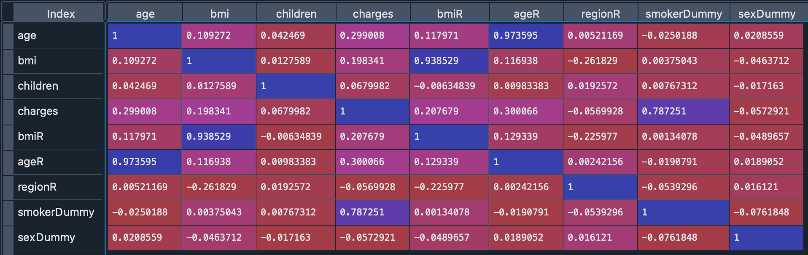

# Medical Cost Predictive Analysis

Dataset: [https://www.kaggle.com/datasets/pavansubhasht/ibm-hr-analytics-attrition-dataset](https://www.kaggle.com/datasets/mirichoi0218/insurance)  

## Code and Resources Used 
**Python Version:** 3.9.12  
**Packages:** pandas  
**Articles:** [Anova and Regression Equivalence](https://web.pdx.edu/~newsomj/mvclass/ho_anova%20and%20regression.pdf)

## Data Wrangling
I initially looked at our basic column structures, stats for each column (min, max, stdev, etc...), and the null values.
The best part of this dataset is there are no null values!

I then switched to looking at our columns data types to get a good understanding of what possible changes we may need to make for our statistical modeling. Here is the recoding I performed:

* Recoded the following Columns floats to integers
    * BMI
    * Age
    * Region

For each of the variables above, they were continuous data. I changed them for 2 reasons:
1. I wanted to match our other categorical variables and run a simple ANOVA
2. BMI and Age are usually broken up into separate categories in the healthcare field. 
   This would allow me to determine a particular age group as opposed to observing individual ages.
   
   
* I created and exported the following for statistical modeling and visualization:
    * Dropped the original BMI, Age and Region columns for the statistical modeling dataset
    * Created another dataframe dropping our newly recoded columns
    * Exported both dataframes separately for each use case

## Data Exploration

1. Data Wrangling
   - I did not initially recode sex or smoker columns from string to integer data, so I used dummy code

2. Looked at Histograms to get a general idea of the shape of our data
   - The data all appears to be shaped as normal distributions with some minor skewing

3. Built a correlation matrix to view correlation between all of the variables
   * Being a smoker seems to have a high correlation in the charges for individuals
   * We will not include the smoker variables in our Statistical Analysis to ensure the other variables 
     have a significant impact charges and not bias our modeling
     
Here is the correlation matrix:

## Statistical Modeling
**Tasks:**

1. Assumption Testing
   - We passed the assumption of Normality, Sample Size and Independence
   - We had 2 variables that violated the assumption of homogeneity of variance
      * BMI
      * Sex
   * We will run two different anovas to account for the violation that occurred

2. Anova
   - In our first Anova we looked at the impact of age and children on charges
      * Age and Children do have a significant impact on the medical charges
   - In our second Anova we corrected for the violation above and looked at the impact of BMI and Sex on charges
      * BMI has a significant impact on medical charges
      * Sex does not have a significant impact by itself
      * We would not move forward with sex, however, it does have a significant effect on BMI, 
         so we should include it in our analysis moving forward

3. Post Hoc Evaluation
   During our post hoc eval, we find that all of our variables carry a significant impact on the difference in charges.
   
   - Age
      * From one category to the next, there is not a significant difference in charges,
        but when you skip from one category to the one after you see a significant difference in charges.
        However, once you go from 50s-60s, there is a significant difference in charges
        
   - Children & Sex
      * Both carry significant impact on charges, but no further evals can be made at this time due its dummy coded nature
   
   - BMI
      * There is no significance in charges until we cross the obesity threshold.
        Once we pass into obesity there is a significance in charges difference until we go from obesity to severe obesity
        
   - Post Hoc Conclusion
      * 1. Individually all of our variables have significant impact on charges.
      * 2. Through our post hoc testing, we have a glimpse into how our ML Model can predict charges between different variable categories
      * 3. We will proceed with our model building with all current variables

## Model Building 
<!-- 
First, I transformed the categorical variables into dummy variables. I also split the data into train and tests sets with a test size of 40%.   

I tried three different models and evaluated them using Mean Absolute Error. I chose MAE because it is relatively easy to interpret and outliers aren’t particularly bad in for this type of model.   

I attempted one model and evaluated the fit for the data. With an 82% accuracy, we have a pretty decent build. However, I will explore further models builds through Lasso Regression and Multiple Linear Regression

Here is the model I tested
*	**Random Forest** – with the sparsity associated with the data, I thought that this would be a good fit. -->

## Model performance
<!-- The Random Forest model performed well and was able to predict employee attrition with 82% accuracy.
*We performed Hyperparameter tuning to enahnce and build the best possible model. The following parameters gave us the best model.
     * Number of Estimators = 50
     * Minimum Samples Leaf = 1
     * Max Depth = 30 -->
     
     
## Conclusions
<!-- * We can predict, with our model, whether an employee will stay with 84% accuracy
* The best predictors of whether someone will stay are in descending order:  
      * Monthly Income  
      * Age 
      * Total Working Years 
      * Hourly Rate 
      * Monthly Rate 
      * Distance from Home 
      * OverTime  -->
      

     

